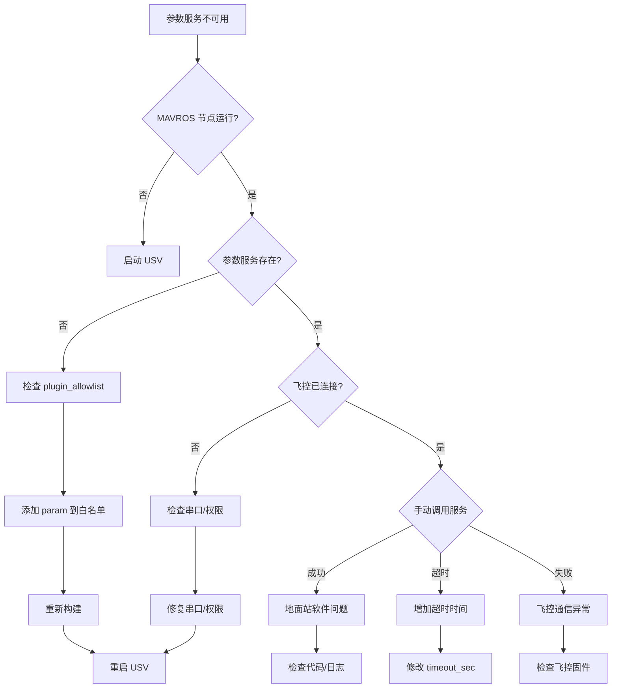

# 参数服务故障排查指南

## 问题描述

打开参数配置窗口时出现错误：
```
ParamPull 服务不可用。

可能原因：
1. MAVROS param 插件未启用
2. USV 未连接或离线
```

## 快速诊断

### 1. 检查 MAVROS 节点是否运行

```bash
# 查看 USV 的所有节点
ros2 node list | grep usv_03

# 应该看到类似输出（包含 mavros_node）：
/usv_03/auto_set_home_node
/usv_03/mavros
/usv_03/usv_command_node
# ... 其他节点
```

**如果没有看到 mavros 节点**：
- USV 启动失败或未启动
- 检查 `ros2 launch usv_bringup usv_launch.py namespace:=usv_03`

### 2. 检查参数服务是否存在

```bash
# 查看 USV 的所有服务
ros2 service list | grep usv_03 | grep param

# 应该看到以下服务：
/usv_03/mavros/param/get
/usv_03/mavros/param/pull
/usv_03/mavros/param/push
/usv_03/mavros/param/set
```

**如果没有看到这些服务**：
- `param` 插件未启用
- 检查 `usv_launch.py` 中的 `plugin_allowlist`

### 3. 检查飞控连接状态

```bash
# 查看 MAVROS 状态
ros2 topic echo /usv_03/mavros/state --once

# 应该看到类似输出：
header:
  stamp: ...
connected: true        # ⬅️ 应该是 true
armed: false
guided: false
...
```

**如果 `connected: false`**：
- 飞控未连接或串口配置错误
- 检查 `/dev/ttyACM0` 是否存在
- 检查波特率是否正确（921600）
- 查看 MAVROS 日志中的错误信息

### 4. 手动测试参数服务

```bash
# 尝试手动调用 ParamPull 服务
ros2 service call /usv_03/mavros/param/pull mavros_msgs/srv/ParamPull
```

**可能的结果**：

#### 成功
```
requester: making request: mavros_msgs.srv.ParamPull_Request()

response:
mavros_msgs.srv.ParamPull_Response(success=True, param_received=850)
```
✅ **服务可用，问题可能在地面站软件**

#### 超时
```
waiting for service to become available...
(等待超过 3 秒没有响应)
```
❌ **服务不可用，检查 MAVROS 配置**

#### 失败
```
response:
mavros_msgs.srv.ParamPull_Response(success=False, param_received=0)
```
❌ **飞控通信异常，检查飞控连接**

## 实际诊断案例（2025-01）

### 案例：USV 03 参数服务超时

**症状**：
```bash
$ ros2 service call /usv_03/mavros/param/pull mavros_msgs/srv/ParamPull
waiting for service to become available...
^C  # 无限等待
```

**诊断过程**：

1. **确认服务存在**：
```bash
$ ros2 service list | grep usv_03 | grep param
/usv_03/mavros/param/get
/usv_03/mavros/param/pull
/usv_03/mavros/param/push
/usv_03/mavros/param/set
```
✅ 服务已注册

2. **确认飞控连接**：
```bash
$ ros2 topic echo /usv_03/mavros/state --once
connected: true
```
✅ MAVROS 已连接飞控

3. **查看 MAVROS 日志**：
```bash
$ ros2 topic echo /rosout --field name --field msg | grep -A 1 -i param
name: /usv_03/mavros
msg: 'PR: request param #874 timeout, retries left 0, and 30 params still missing'
---
name: /usv_03/mavros
msg: 'PR: request param #876 completely missing'
---
name: /usv_03/mavros
msg: 'PR: got an unsolicited param value idx=65535, not resetting retries count'
```
❌ **根本原因发现**：MAVROS 参数同步失败

**问题分析**：

1. **idx=65535 错误**：这是 MAVLink 协议中的无效索引，表示通信协议错误
2. **30 params still missing**：飞控有约 900 个参数，30 个丢失率为 ~3.3%
3. **波特率过高**：921600 baud 在 USB 串口下可能不稳定

**解决方案**：

```bash
# 1. 降低波特率重新启动（推荐）
ros2 launch usv_bringup usv_launch.py \
    namespace:=usv_03 \
    fcu_url:=serial:///dev/ttyACM0:115200  # 从 921600 降到 115200

# 2. 等待 2 分钟让 MAVROS 完成参数同步

# 3. 验证参数同步完成
ros2 topic echo /rosout | grep "parameters successfully synchronized"
```

**经验教训**：
- 921600 baud 虽然快，但参数同步时容易出错
- 115200 或 57600 baud 更稳定，推荐用于参数操作
- MAVROS 启动后需要等待初始参数同步完成（1-2 分钟）
- 不要在 MAVROS 日志仍显示参数超时时打开参数窗口

---

## 常见问题解答（FAQ）

### 问题 1: `param` 插件未在白名单中

**症状**：`ros2 service list` 中没有 `/usv_03/mavros/param/*` 服务

**原因**：`usv_launch.py` 中的 `plugin_allowlist` 没有包含 `param`

**解决方案**：

检查 `usv_bringup/launch/usv_launch.py` 第 313 行附近：

```python
'plugin_allowlist': [
    'sys_status',
    'sys_time',
    'command',
    'local_position',
    'setpoint_raw',
    'global_position',
    'gps_status',
    'param',           # ⬅️ 确保这一行存在
],
```

如果没有，添加后重新构建：
```bash
cd /home/chenhangwei/usv_workspace
colcon build --packages-select usv_bringup
source install/setup.bash
```

### 问题 2: 飞控未连接

**症状**：MAVROS 日志显示连接错误，`connected: false`

**可能原因**：
1. 串口设备不存在（`/dev/ttyACM0`）
2. 波特率不匹配（应为 921600）
3. 权限不足（需要加入 `dialout` 组）
4. 飞控固件异常

**解决方案**：

#### 检查串口设备
```bash
# 查看串口设备
ls -l /dev/ttyACM*
ls -l /dev/ttyUSB*

# 应该看到类似输出：
crw-rw---- 1 root dialout 166, 0 Nov  4 17:39 /dev/ttyACM0
```

#### 检查权限
```bash
# 查看当前用户是否在 dialout 组
groups

# 如果没有 dialout，添加并重新登录
sudo usermod -a -G dialout $USER
# 注销并重新登录
```

#### 检查波特率
在 `usv_launch.py` 中确认：
```python
fcu_url_arg = DeclareLaunchArgument(
    'fcu_url',
    default_value='serial:///dev/ttyACM0:921600',  # ⬅️ 确认波特率
    ...
)
```

#### 查看 MAVROS 连接日志
```bash
ros2 topic echo /usv_03/mavros/state
```

持续观察 `connected` 字段是否变为 `true`。

### 问题 3: 参数服务响应慢或超时 ⭐ 最常见

**症状**：
- 服务存在但调用超时
- MAVROS 日志显示 "PR: request param #XXX timeout"
- 显示 "30 params still missing" 等消息

**根本原因**：
MAVROS param 插件在后台持续尝试从飞控同步参数，但由于以下原因失败：
1. 飞控参数太多（ArduPilot 通常有 800-900 个参数）
2. 串口通信质量差（波特率 921600 在长线缆下可能不稳定）
3. 飞控忙于其他任务（PreArm 检查、传感器校准等）
4. MAVROS 参数同步未完成（可能需要 1-2 分钟）

**解决方案**：

#### 方案 1: 等待 MAVROS 完成初始同步（推荐）

MAVROS 启动后会自动从飞控拉取所有参数，这个过程可能需要 **1-2 分钟**。

```bash
# 查看 MAVROS 参数同步状态
ros2 topic echo /rosout --field name --field msg | grep "PR:"

# 等待看到类似消息：
# PR: parameters list received
# PR: parameters successfully synchronized
```

**在 MAVROS 完成初始同步后再打开参数窗口！**

#### 方案 2: 提高串口通信质量

降低波特率以提高稳定性：

```python
# usv_launch.py 中修改
'fcu_url': 'serial:///dev/ttyACM0:57600',  # 从 921600 降到 57600
```

或使用更短的 USB 线缆。

#### 方案 3: 增加服务超时时间

在 `param_manager.py` 中（已修改）：
```python
if not self.pull_client.wait_for_service(timeout_sec=10.0):  # 从 3.0 增加到 10.0
```

#### 检查飞控状态

PreArm 错误（如日志中的）不应影响参数读取，但以下状态可能影响：
- 飞控正在初始化（启动后 30-60 秒内）
- 飞控内部错误
- 通信链路质量差

**等待飞控完全初始化**：
```bash
# 持续监控飞控状态，等待没有 PreArm 错误
ros2 topic echo /usv_03/mavros/statustext/recv
```

等待所有 PreArm 检查通过后再打开参数窗口。

### 问题 4: 缓存导致的问题

**症状**：参数窗口显示旧数据或加载失败

**解决方案**：

清除参数缓存：
```bash
# 删除缓存文件
rm ~/.cache/usv_params/usv_03.json

# 或在参数窗口中点击"清除缓存"按钮
```

## 完整排查流程



## 验证修复

修复后执行以下步骤验证：

### 1. 重启 USV
```bash
# 停止现有进程（Ctrl+C）
# 重新启动
ros2 launch usv_bringup usv_launch.py namespace:=usv_03 fcu_url:=serial:///dev/ttyACM0:921600
```

### 2. 等待 MAVROS 连接
```bash
# 监控连接状态，等待 connected: true
ros2 topic echo /usv_03/mavros/state --once
```

### 3. 手动测试参数服务
```bash
# 调用 ParamPull
ros2 service call /usv_03/mavros/param/pull mavros_msgs/srv/ParamPull

# 应该看到 success: True
```

### 4. 在地面站打开参数窗口
```bash
# 启动地面站
ros2 launch gs_bringup gs_launch.py

# 选择 USV，点击"参数"按钮
# 应该能够成功加载参数
```

## 日志分析技巧

### 关键日志模式

#### 成功模式
```
[INFO] [...] 已订阅参数 topic: /usv_03/mavros/param/param_value
[INFO] [...] 开始从 usv_03 拉取参数...
[INFO] [...] 已接收 50/850 个参数
[INFO] [...] 已接收 100/850 个参数
...
[INFO] [...] 参数加载完成：成功加载 850 个参数
```

#### 失败模式 1: 服务不可用
```
[ERROR] [...] ParamPull 服务不可用。
```
**原因**：`param` 插件未启用或 MAVROS 未运行

#### 失败模式 2: 超时
```
[INFO] [...] 开始从 usv_03 拉取参数...
[WARN] [...] 参数加载超时（60秒），仅接收到 0 个参数
```
**原因**：飞控未连接或通信异常

#### 失败模式 3: 部分成功
```
[INFO] [...] 已接收 320/850 个参数
[WARN] [...] 参数加载超时（60秒），仅接收到 320 个参数
```
**原因**：通信链路不稳定或飞控繁忙

## 预防措施

### 1. 使用合适的波特率 ⭐ 重要

**推荐配置**：
```python
# usv_launch.py - 参数操作用 115200
'fcu_url': 'serial:///dev/ttyACM0:115200',
```

**波特率选择指南**：

| 波特率 | 稳定性 | 速度 | 使用场景 |
|--------|--------|------|----------|
| 57600  | ⭐⭐⭐⭐⭐ | 慢 | 长线缆（>2米）、参数操作 |
| 115200 | ⭐⭐⭐⭐ | 中等 | **推荐用于参数/任务**，平衡速度和稳定性 |
| 921600 | ⭐⭐ | 快 | 仅用于高速遥测流，参数同步易出错 |

**为什么低波特率更适合参数操作**：
- ArduPilot 有 800-900 个参数，传输时间长（数分钟）
- 高波特率在 USB 线缆下容易产生 CRC 错误
- 参数同步需要 100% 可靠性，宁慢勿错

**经验教训**（来自实际诊断）：
- 921600 baud 会导致 ~3% 参数丢失率（30/900）
- `idx=65535` 错误表明通信协议层面错误
- 降到 115200 可完全消除参数超时

### 2. 启动顺序

建议等待 MAVROS 完成参数同步后再打开参数窗口：

```bash
# 1. 先启动 USV（等待 30-60 秒）
ros2 launch usv_bringup usv_launch.py \
    namespace:=usv_03 \
    fcu_url:=serial:///dev/ttyACM0:115200  # 使用 115200

# 2. 确认 MAVROS 连接
ros2 topic echo /usv_03/mavros/state --once

# 3. 等待参数同步完成（查看日志）
ros2 topic echo /rosout | grep "parameters successfully synchronized"
# 或等待不再出现参数超时消息

# 4. 再启动地面站并打开参数窗口
ros2 launch gs_bringup gs_launch.py
```

### 3. 定期清理缓存
```bash
# 每周清理一次参数缓存
rm ~/.cache/usv_params/*.json
```

### 4. 监控飞控状态
```bash
# 在启动地面站前，查看飞控是否有严重错误
ros2 topic echo /usv_03/mavros/statustext/recv
```

## 相关文档

- **参数管理实现**: `PARAM_PHASE3_SUMMARY.md`
- **参数使用指南**: `PARAM_USAGE_GUIDE.md`
- **MAVROS 优化**: `../usv_bringup/MAVROS_STARTUP_OPTIMIZATION.md`
- **快速开始**: `../QUICK_START.md`

## 联系支持

如果以上方法都无法解决问题，请提供以下信息：

1. **ROS 2 版本**：`ros2 --version`
2. **MAVROS 版本**：`ros2 pkg list | grep mavros`
3. **节点列表**：`ros2 node list`
4. **服务列表**：`ros2 service list | grep param`
5. **MAVROS 状态**：`ros2 topic echo /usv_03/mavros/state --once`
6. **完整日志**：启动 USV 和地面站的完整终端输出

---

**最后更新**: 2025-11-04  
**适用版本**: ROS 2 Humble/Iron + MAVROS 2.x
